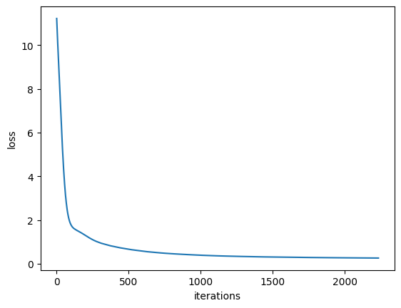
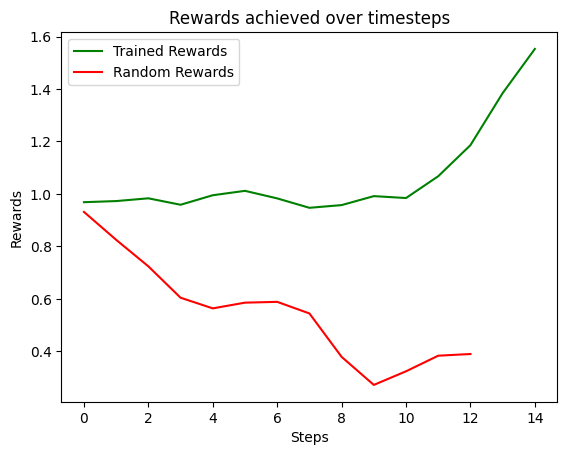
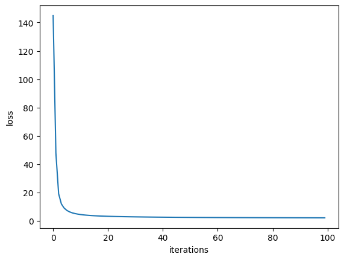
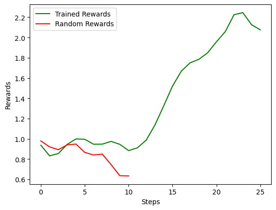

# Model-free Reinforcement Learning that Transfers using Random Features

This repo contains project done for course ELL729-Stochastic Control and Reinforcement Learning, taught by Prof. Arpan Chattopadhyay at IIT Delhi.

# Introduction

As a part of the course project, we implemented the paper titled "*Model-free Reinforcement Learning that Transfers using Random Features*". We experimented the proposed algorithm in certain environments using *OpenAI Gym* and *MuJoCo* simulator. 

The paper proposes a new approach to reinforcement learning (RL) that combines the benefits of model-free and model-based RL algorithms. The authors introduce a method for transferring behaviors across tasks with different reward functions by using model-free RL with randomly sampled features as reward to implicitly model long-horizon environment dynamics. They demonstrate that this approach enables quick adaptation to problems with new reward functions, while scaling to problems with high dimensional observations and long horizons. The paper provides theoretical justifications for the methodology and presents experimental results demonstrating its effectiveness in solving RL problems. Overall, the paper presents a promising new approach to RL that has potential for real-world applications.

 # Model-Based v/s Model-Free RL

Generally, there are two broad approaches to solve Reinforcement Learning (RL) problems - *Model-based* and *Model-free*.

**Model-based RL** involves building a model of the environment, including the transition dynamics and reward function, and using this model to plan actions. The advantage of this approach is that it can be more sample-efficient than model-free methods, especially in settings with sparse rewards or long horizons. However, building an accurate model can be difficult, and errors in the model can lead to sub-optimal behavior.

**Model-free RL**, on the other hand, does not require a model of the environment. Instead, it learns a value function or policy directly from experience. The advantage of this approach is that it can be more robust to modeling errors and can handle complex environments with high-dimensional state spaces. However, it can be less sample-efficient than model-based methods and may struggle with transfer learning across tasks with different reward functions.

Both approaches have their advantages and disadvantages depending on the specific problem at hand. Model-based methods may be more sample-efficient but require an accurate model of the environment, while model-free methods are more robust but may require more data to learn an optimal policy.

# Problems with traditional Model-free approaches

Typical model-free RL algorithms can struggle to transfer across tasks with different reward functions due to the following challenges:

1. **Overfitting to the specific reward function of the training task:** Model-free RL algorithms learn a policy that maximizes the expected cumulative reward for a specific reward function. If the reward function changes in a new task, the learned policy may not be optimal for the new task.

2. **Exploration-exploitation trade-off:** Model-free RL algorithms rely on exploration to discover optimal policies. When transferring to a new task, exploration may be less effective if the agent has already learned a good policy in the previous task.

3. **Curse of dimensionality:** Model-free RL algorithms can struggle with high-dimensional state spaces, which can make it difficult to generalize across tasks with different state spaces.

4. **Long horizons:** Model-free RL algorithms can struggle with long-horizon problems, where rewards are sparse and delayed over time. This can make it difficult to learn an optimal policy that takes into account long-term consequences of actions.
    

To address these challenges, various methods have been proposed in literature for transferring knowledge across tasks, such as transfer learning, meta-learning, and multi-task learning.
# Proposed Approach
The approach proposed in paper combines the benefits of model-free and model-based RL algorithms by using model-free RL with randomly sampled features as reward to implicitly model long-horizon environment dynamics. This approach allows for quick adaptation to problems with new reward functions, while scaling to problems with high dimensional observations and long horizons.

Specifically, the authors use a set of randomly sampled features of the state as a proxy for the environment dynamics. They then use a model-free RL algorithm to learn a set of Q-functions that map from states and actions to expected cumulative rewards. These Q-functions are learned using the randomly sampled features as reward, rather than the true reward function.

At test time, the learned Q-functions can be used with any reward function, allowing for transfer across tasks with different reward functions. The authors also propose a model-predictive control algorithm that uses these learned Q-functions to plan actions in real-time.

The approach is described step-by-step below in Algorithm- in more detail:

 **Input:** 
1. Offline dataset D, where \}_{h\in[H],m\in[M]}), where `H` is the length of the trajectories, `M` is the total number of trajectories,  and  are the state and action taken respectively at the  timestep of the  trajectory - with the assumption that all transitions are collected under the same transition dynamics `T`.

2. Distribution `p` over 

3. Number of random features `K`

 **Offline Training Phase:**
 1. Randomly sample  with  and construct the dataset: 

    ,\sum_{h\in[H]}{\gamma^{h-1}\phi(s_h^m,a_h^m;\theta_k)})\\}_{m\in[M],k\in[K]})

Here,  is the discount factor, i.e., ), and ) is a neural network with weights . 

2. Fit random Q-basis functions :S\times{A^H}\to{R}) for  by minimizing the loss over the dataset , (where, `S` and `A` are the state and action space respectively):

-\sum_{h\in[H]}{\gamma^{h-1}\phi(s_h^m,a_h^m;\theta_k)})^2})

 **Online Planning Phase:**
1. Fit the testing task's reward function `$r(.,.)$` with linear regression on random features:

  -\sum_{k\in[K]}{w_k\phi(s_h^m,a_h^m;\theta_k)})^2}+\lambda\|w\|^2})

2. Sample 

3. Randomly generate `N` sequence of actions 
4. Find the best sequence such that
    
    }})
    
    Execute  from the sequence , observe the new state )
    

# Implementation
We used OpenAI Gym to create the simulation environment. Once, the environment was created, we fetched the observation space and action space of the environment to calculate `D` which is the dimension for the random features. Now our implementation is divided into 4 phases:

1. Offline Training
2. Online Planning
3. Policy Compliant Motion
4. Rendering and Visualisation of the trajectories

## Offline Training
First, we created the dataset for offline training. This dataset will be denoted by . Given K random features, M samples, probability distribution p over `$R^d$` and discount factor , we will first sample random features  as:

    with 

Using the above random features, we will form our dataset as:

   ,\sum_{h\in[H]}{\gamma^{h-1}\phi(s_h^m,a_h^m;\theta_k)})\\}_{m\in[M],k\in[K]})

Then, we trained random Q-basis functions :S\times{A^H}\to{R}) function which is parameterised over . In our case, we trained K unit Linear layer with activation as tanh. The loss function used to train the paramaters:  was mean squared loss:

   -\sum_{h\in[H]}{\gamma^{h-1}\phi(s_h^m,a_h^m;\theta_k)})^2})

## Online Training
First, we created the dataset for online planning. This dataset will be denoted by . Given the K random features and M samples containing rewards r:

   _{k\in[K]},r(s_h^m,a_h^m))\\}_{m\in[M],h\in[H]})

Using above dataset, we fit the parameters w using Linear Regression. The loss function used is described below:

   -\sum_{k\in[K]}{w_k\phi(s_h^m,a_h^m;\theta_k)})^2}+\lambda\|w\|^2})

This training is carried out in batches and hence SGDRegressor was used. Regularization was also used to smoothen the training and avoid any overfitting.

## Policy Compliant Motion
Once we have trained parameters  and , we formed a method that can provide us with the most optimal action given the current state . 

First, we randomly sample H actions N times to create N H-horizon action sequences .

The below equation is used to find the best sequence out of the lot:

   }})

And the best immediate action is taken to be:

   

This is carried out every step to find the optimal action.

## Rendering and Visualisation of Trajectories
We used media\_py library of python to visualise the motion of agent in the environment. An RGB screen of size: (480, 480) is fetched from the environment at every timestep and was rendered at the framerate of 30fps.

# Experiments
% Hyperparameters for randomly trained model and expertly trained model
% Results for both cases compared with the random model
% Some plots
Hopper-v2 environment was used to create the simulation. The observation space in the environment is 11-dimensional and action space is 3-dimensional with action values lying in the range of [-1,1]. These made our random features  to belong to 

In order to train our agent for both the phases, we used two datasets: 

     1. Hopper-v2-random
     2. Hopper-v2-expert

## Hopper-v2-random
After creating the hopper-v2 environment using OpenAI Gym, we sampled M paths of H-horizon each to create the samples. The details of the dataset is provided below:

|Number of paths (M)|Horizon length (H)|Average total reward|
|----------|-----|----|
|10000 |200 |19.734|

We kept number of Q-basis functions (K) = 256. Training the model using these hyperparameters, we tested on 1000 trajectories with different starting states. Number of epochs were set to 2500. The training graph of the model is shown here. 

We also tested out 1000 trajectories with random policy with same starting states to calculate some metrics.

Below graph shows the reward progression of a trajectory from random policy and policy trained on Hopper-v2-expert.

       

## Hopper-v2-expert
We used the Hopper-v2-expert dataset available at OpenAI Gym. The number of paths in the dataset is 3213. We first took a window of size H=200 to extract H-horizon trajectories. The paths with length lesser than H were appended with 0-actions and 0-rewards with static observations. This provided us with a dataset of following specifications:

|Number of paths (M)|Horizon length (H)|Average total reward|
|--|--|--|
|138000 | 200 | 201.654|

We again kept K=256. Similar to the above case, we again tested our model on same set of starting states. We trained our model with 100 epochs. 

  

The following metrics were obtained at the end.

|&nbsp;|Average path length|Average total reward|Maximum reward obtained|
|--|--|--|--|
|Random Policy|8.9 |16.332 | 1.02|
|Hopper-v2-random|  18.52 | 20.807 | 1.9|
|Hopper-v2-expert|  25.4 | 91.645 | 3.4

Below graph shows the reward progression of a trajectory from random policy and policy trained on Hopper-v2-expert.

# Conclusion and Future Works
Various experiments suggest that it outperforms existing model-free methods in terms of transferability across tasks with different reward functions, while also scaling well to problems with high dimensional observations and long horizons. These findings suggest that the proposed approach has great potential for real-world applications where transfer learning is necessary.

One potential avenue for future research in this direction could be to explore the effectiveness of the proposed approach on more complex and diverse tasks, such as those involving multi-agent systems or real-world robotics applications. Another possible direction could be to investigate the impact of different feature selection methods on the performance of the proposed approach. Additionally, it may be interesting to explore how the proposed approach can be combined with other techniques, such as deep reinforcement learning or imitation learning, to further improve its performance and applicability.

